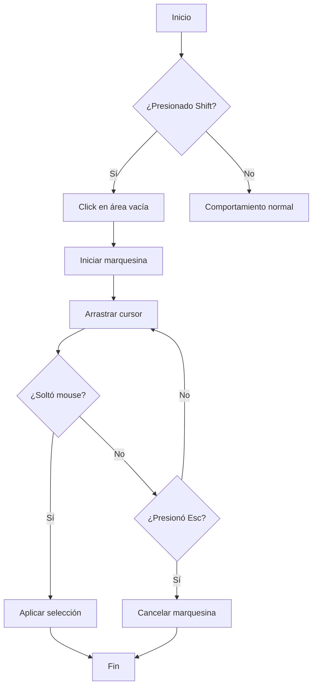

# 🎯 Selección Múltiple por Marquesina - Demo

## ¿Qué es?

Implementación de **selección múltiple mediante arrastre de rectángulo** (marquee selection), similar al comportamiento del escritorio de Windows. Permite seleccionar varios elementos del canvas dibujando un área de selección.

## 🎥 Cómo funciona

### Paso 1: Activa la marquesina


Mantén presionada la tecla **Shift** y haz clic en un área vacía del canvas.

### Paso 2: Dibuja el área de selección


Sin soltar **Shift**, arrastra el cursor para dibujar un rectángulo azul semi-transparente.

### Paso 3: Selecciona elementos


Todos los elementos que intersectan con el rectángulo serán seleccionados automáticamente.

### Paso 4 (Opcional): Cancela


Presiona **Esc** en cualquier momento para cancelar la selección.

---

## 📋 Características

| Característica | Descripción |
|----------------|-------------|
| ⌨️ **Activación** | `Shift` + Clic en área vacía |
| 🎨 **Visual** | Rectángulo azul con borde punteado |
| 🔍 **Detección** | Intersección inteligente (incluye parcial) |
| ❌ **Cancelar** | Tecla `Esc` |
| 🚫 **No interfiere** | Desactiva temporalmente el pan del canvas |

---

## 🖼️ Vista del Canvas

```
┌─────────────────────────────────────────┐
│                                         │
│     ╔═══════════════════╗              │
│     ║                   ║  ← Marquesina │
│     ║   [El-1]  [El-2] ║  (Shift+Drag) │
│     ║                   ║              │
│     ║   [El-3]          ║              │
│     ╚═══════════════════╝              │
│                                         │
│           [El-4]     [El-5]            │
│                                         │
└─────────────────────────────────────────┘
```

En este ejemplo:
- ✅ `El-1`, `El-2`, `El-3` → **Seleccionados** (dentro de marquesina)
- ❌ `El-4`, `El-5` → **No seleccionados** (fuera de marquesina)

---

## 🎬 Flujo de Uso



---

## 💡 Tips

1. **Selección Parcial**: No necesitas cubrir completamente un elemento, basta con que el rectángulo lo toque.

2. **Áreas Vacías**: Solo funciona cuando haces clic en un área vacía del canvas (no sobre un elemento existente).

3. **Modo Edición**: Asegúrate de estar en modo edición (no modo visualización).

4. **Sin Cambios Pendientes**: No funciona si tienes cambios sin guardar en otro elemento.

---

## 🔧 Implementación Técnica

### Archivos Creados/Modificados

```
src/inventory-smart/
├── composables/
│   └── useMarqueeSelection.js      ← Lógica principal (NUEVO)
├── components/
│   ├── CanvasView.vue              ← Integración (MODIFICADO)
│   └── MarqueeHint.vue             ← Hint visual (NUEVO)
└── __tests__/
    └── marquee_selection.spec.js   ← Tests (NUEVO)

docs/
└── marquee-selection.md            ← Documentación (NUEVO)
```

### Componentes Clave

1. **`useMarqueeSelection`** - Composable con toda la lógica
2. **`MarqueeHint`** - Componente visual de ayuda
3. **`CanvasView`** - Integración con eventos del canvas

---

## 🧪 Cobertura de Tests

✅ 10 tests pasando:
- Inicialización
- Inicio y actualización
- Cálculo normalizado (todas direcciones)
- Detección múltiple
- Finalización y cancelación
- Intersección parcial

```bash
npm run test:unit -- marquee_selection
```

---

## 🚀 Próximas Mejoras

- [ ] Selección múltiple real (actualmente selecciona el primero)
- [ ] Modos adicionales (Shift=agregar, Ctrl=quitar, Alt=invertir)
- [ ] Acciones en lote (mover/eliminar/bloquear múltiples)
- [ ] Contador visual de elementos seleccionados
- [ ] Resaltado en tiempo real durante arrastre

---

## 📚 Documentación Completa

Para más detalles técnicos, consulta:
- 📖 [Documentación Completa](../docs/marquee-selection.md)
- 🧪 [Tests](../src/inventory-smart/__tests__/marquee_selection.spec.js)
- 💻 [Código Fuente](../src/inventory-smart/composables/useMarqueeSelection.js)

---

**Versión**: 1.0.0  
**Fecha**: Octubre 2025  
**Estado**: ✅ Funcional y Testeado
